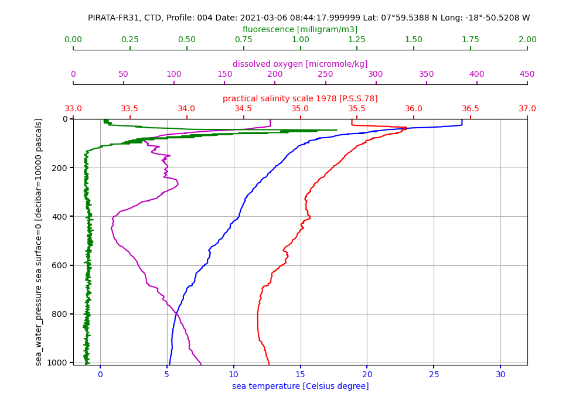
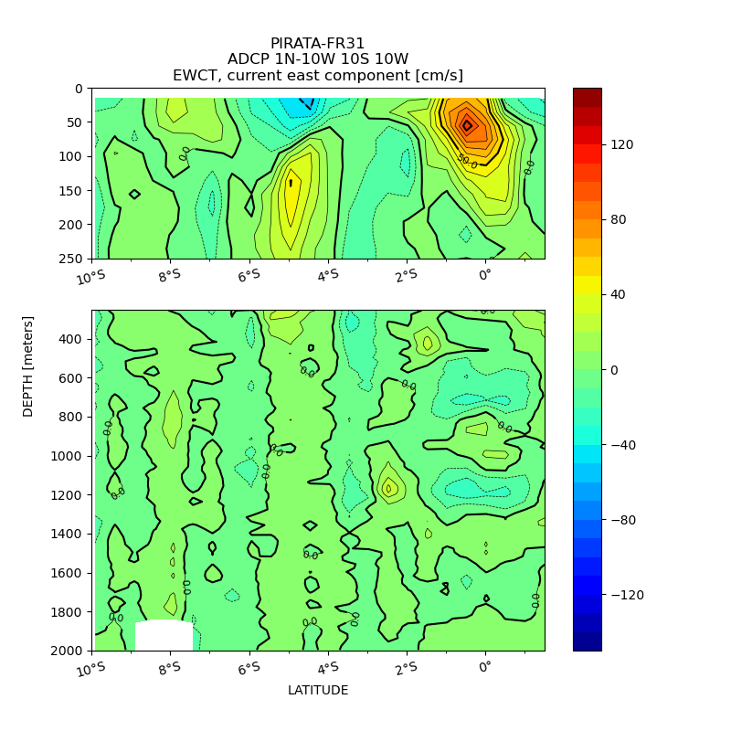
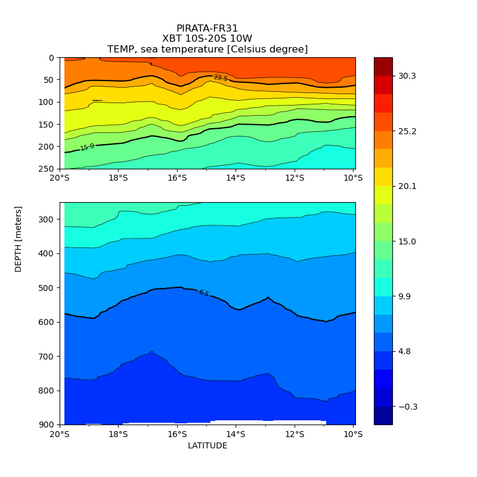

# Python-plots

Plots profiles and CTD sections with Python from NetCDF OceanSITES files

## Installation

```sh
conda install -c conda-forge netCDF4 scipy matplotlib cartopy cartopy_offlinedata toml
```

```sh
pip3 install julian
```

## Tests

```sh
make ctdp
make xbts
```

## Usage

```sh
python plots.py -h
usage:
python plots.py -t <TYPE> -s (SECTIONS) <OPTIONS> ... | -p (PROFILES) <OPTIONS> ...
PROFILES:
python plots.py netcdf/OS_PIRATA-FR31_CTD.nc -t CTD -p -k PRES TEMP PSAL DOX2 FLU2 -g -c k- b- r- m- g-
python plots.py netcdf/OS_PIRATA-FR31_XBT.nc -t XBT -p -k DEPTH TEMP DENS SVEL -c k- b- k- g- -g
python plots.py netcdf/OS_PIRATA-FR31_ADCP.nc -t ADCP -p -k DEPTH EWCT NSCT -c k- r- b- -g
SECTIONS:
python plots.py netcdf/OS_PIRATA-FR31_CTD.nc -t CTD -s -k PRES TEMP -l 5 28 --xaxis LATITUDE --yscale 0 250 250 2000 --xinterp 24 --yinterp 200 --clevels=30 --autoscale 0 30
python plots.py netcdf/OS_PIRATA-FR31_CTD.nc -t CTD -s --append 1N-10W_10S_10W -k PRES PSAL -l 5 28 --xaxis LATITUDE --yscale 0 250 250 2000 --xinterp 24 --yinterp 100 --clevels=15 --autoscale 34 37
python plots.py netcdf/OS_PIRATA-FR31_ADCP.nc -t ADCP -s --append point-fixe_0-10W -k DEPTH EWCT NSCT -l 33 45 --xaxis TIME --yscale 0 500 --xinterp 20 --yinterp 50 --clevels 15 --autoscale -150 150
python plots.py netcdf/OS_PIRATA-FR31_XBT.nc -t XBT -s DEPTH TEMP -xaxis LATITUDE
python plots.py netcdf/OS_PIRATA-FR31_XBT.nc -t XBT -s DEPTH TEMP -xaxis TIME -l 29 36

This program read CTD NetCDF file and plot parameters vs PRES

positional arguments:
  files                 netcdf file to parse

optional arguments:
  -h, --help            show this help message and exit
  -a APPEND, --append APPEND
                        string to append in output filename
  -t {CTD,XBT,ADCP}, --type {CTD,XBT,ADCP}
                        select type instrument CTD, XBT or LADCP
  -p, --profiles, --profile
                        plot profiles
  -k KEYS [KEYS ...], --keys KEYS [KEYS ...]
                        select physical parameters key(s), (default: None)
  -l LIST [LIST ...], --list LIST [LIST ...]
                        select first and last profile, default (none) is all
  -e [EXCLUDE [EXCLUDE ...]], --exclude [EXCLUDE [EXCLUDE ...]]
                        give a list of profile(s) to exclude
  -c COLORS [COLORS ...], --colors COLORS [COLORS ...]
                        select colors, ex: k- b- r- m- g-
  -g, --grid            add grid
  -s, --sections, --section
                        plot sections
  --xaxis {LATITUDE,LONGITUDE,TIME}
                        select xaxis for sections
  --yscale [YSCALE [YSCALE ...]]
                        select vartical scale for sections, ex: 0 2000 or 0 250 250 2000
  --xinterp XINTERP     horizontal interpolation points
  --yinterp YINTERP     vertical interpolation step, none plot raw data
  --clevels CLEVELS     contour levels
  --autoscale [AUTOSCALE [AUTOSCALE ...]]
                        None:       use NetCDF valid min and max
                        True:       use min(Z) and max(Z)
                        [min, max]: define manually min and max
  --display, --display_profiles
                        display profiles number on top axes
  -o OUT, --out OUT     output path, default is plots/
  -d, --debug           display debug informations

J. Grelet IRD US191 - March 2021 / April 2021
```

## Examples

See the shell script used in PIRATA-FR31 cruise launch with cron job:

[python-plots.sh](https://git.outils-is.ird.fr/US191/CRDAP/-/blob/THALASSA/local/sbin/python-plots.sh)






